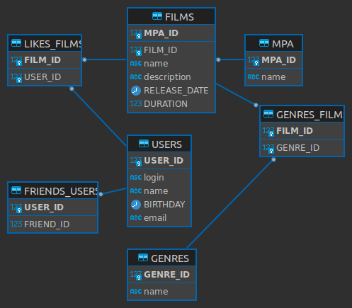

# java-filmorate
Template repository for Filmorate project.

Схема базы данных из DBeaver



Таблица пользователей users связана с таблицами друзей friends_users и лайков фильмам likes_films по идентификатору user_id.

Таблица лайков likes_films связана с таблицей фильмов films по идентификатору film_id.

Таблица фильмов films связана с таблицей рейтинга по идентификатору mpa_id.

Далее таблица фильмов films связана с таблицей жанов через промежуточную таблицу genres_films по идентификаторам film_id и genre_id.

Пример SQL запроса для вывода 10 наиболее популярных фильмов по количеству лайков:
```
SELECT l.FILM_ID, f."name", f."description", f.RELEASE_DATE, f.DURATION, COUNT(l.USER_ID)
FROM LIKES_FILMS l
	JOIN FILMS f ON l.FILM_ID = f.FILM_ID 
GROUP BY l.FILM_ID
ORDER BY COUNT(l.USER_ID) DESC
LIMIT 10;
```
